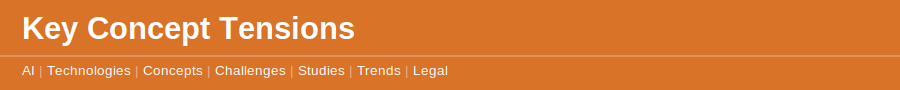

`2026 May 31`

Several of the tensions explored in the concepts section are directly load-bearing for anyone putting AI to work, not merely interesting to think about. [The Apprentice That Never Arrives](disclaimer.md) concept names the long-term institutional cost of automating the entry-level rung: expertise requires the reps that AI is removing the need for. [The Outsourced Faculty](disclaimer.md) concept draws the line between delegations that extend capability and delegations that amputate it — using AI to draft faster is extension; using AI to think for you is amputation, and the two are harder to distinguish in practice than in theory. [The Vanishing Draft](disclaimer.md) concept makes the same observation at a smaller scale: AI skips the draft, but thinking happened in the draft, and the output arrives without the process that built comprehension.

For a practitioner working with clients, three concepts carry immediate strategic weight. [The Transparent Machine](disclaimer.md) concept explores AI that shows its reasoning on demand — the design principle that creates client trust in AI-assisted outputs. [The Plausible Lie](disclaimer.md) concept examines the calibration skill required when working with systems that are fluent, confident, and sometimes wrong — the practitioner's most important technical competence is not prompting but verifying. [The Closing Window](disclaimer.md) concept observes that automating always-on communication does not remove the compulsion to answer — the psychological contract with clients does not change when the tool does.

At the scale of markets and institutions, [The Speed Gap](disclaimer.md) concept explains why regulation consistently lags the technology it is trying to govern — institutions are too slow for reality, and often slow by design. [The Default Is the Law](disclaimer.md) concept argues that whoever sets the default in a system governs without commanding: the setting that ships in a product is the one most users experience, making default choices more consequential than any formal policy. [The Patient Adversary](disclaimer.md) concept examines the asymmetry between automated threats that cannot run out of time and human defenders who must. These are not abstract puzzles. They are the operating conditions of every AI deployment in 2026.
