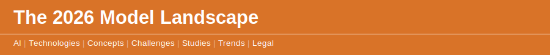
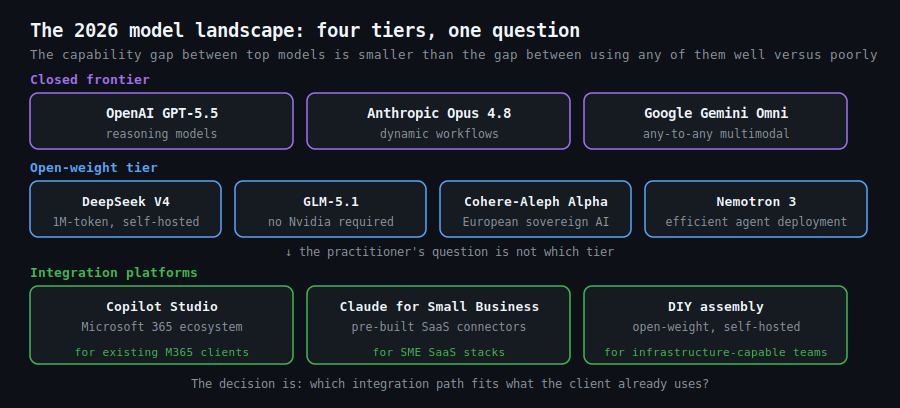

`2026 May 31`

The LLM provider landscape in 2026 has consolidated around four credible frontier tiers and fragmented dramatically everywhere else. At the closed frontier: OpenAI (GPT-5.5 and reasoning models), Anthropic (Claude Opus 4.8 with dynamic workflows), and Google (Gemini Omni, any-to-any multimodal). [The April 2026 frontier wave](disclaimer.md) saw GPT-5.5 and Claude Opus 4.7 arrive within days of each other. The marginal capability difference between them is smaller than the marginal difference between using either well versus using either poorly. The model is no longer the decision that matters most.

The open-weight tier has accelerated faster than the closed models anticipated. [DeepSeek V4 Preview](disclaimer.md) operates on a million-token context and is available for self-hosted deployment. [China's GLM-5.1](disclaimer.md) topped a coding leaderboard trained without a single Nvidia chip, demonstrating that frontier capability no longer requires Western semiconductor access. [The Cohere–Aleph Alpha merger](disclaimer.md) created a European sovereign AI alternative. [NVIDIA's Nemotron 3](disclaimer.md) offers an efficient open-weight model designed specifically for cheap agent deployment. A business willing to manage self-hosted infrastructure can access near-frontier capability at a fraction of API pricing.

For a practitioner, the model landscape question is a positioning question, not a technology one. Most SME clients do not need to choose a model — they need a workflow that integrates with the tools they already use. [Microsoft Copilot Studio with computer-using agents going generally available](disclaimer.md) means businesses inside the Microsoft 365 ecosystem have a capable starting point without an additional vendor. [Anthropic's Claude for Small Business with nine pre-built SaaS connectors](disclaimer.md) is designed for the SME entry point. The consultant's role is to match the client's existing infrastructure to the model tier and integration path that fits — not to recommend the theoretically most powerful option.
