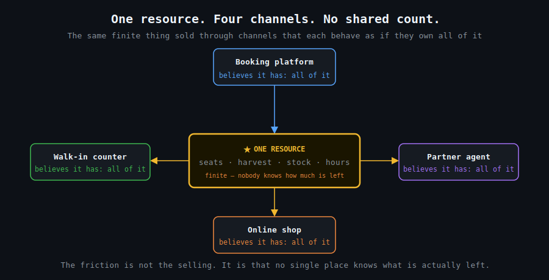

# The Channel That Doesn't Know About the Other Channels

`2026 June 2`

Read enough small businesses and the same shape keeps appearing.

One finite thing — seats on a boat, a single harvest, hours on a court, a tray of something perishable — sold through several channels that each behave as if they own all of it. [A single vessel sells the same seats through four channels that each think the boat is theirs](disclaimer.md). [One harvest is sold every month with nobody counting what is left](disclaimer.md). [A pit sells at the counter and ships nationally with no shared count](disclaimer.md). [Six courts leak their quiet weekday hours unseen](disclaimer.md).

The friction is never the selling. It is that no single place knows what is actually left. [The recurring pattern across dozens of these businesses](2026-05-31-sme-back-office-patterns.md) is a missing shared view of one scarce resource — and it is also the most tractable. [Forecasting demand and reconciling stock before you run out rather than after](disclaimer.md) is exactly the kind of dull, rule-bound reconciliation AI handles well. The business does not need a strategy. It needs one screen that tells the truth.
