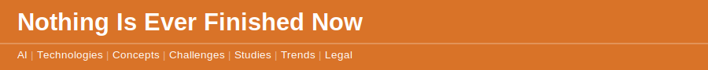

`2026 June 2`

There is a particular fatigue in adopting a tool that will not stop changing. The [Permanent Beta](disclaimer.md) concept names the condition: when nothing is ever finished, nothing can be rested in. The model you trained your team on last quarter has already been replaced. [A leading model now ships new capabilities every few weeks](disclaimer.md), and [the frontier wave arrives faster than most organisations can absorb a single release](disclaimer.md). The ground keeps moving under the people standing on it.

The instinct is to wait for things to settle. They will not — that is the condition, not a phase. The more useful response is the one the labs themselves landed on: [the model stopped being the bottleneck a while ago](2026-05-31-model-not-bottleneck.md). What matters is whether your processes can absorb a better model without being rebuilt each time. Adopt the habit, not the version. The tool you pick will be out of date. The way you work with it does not have to be.
