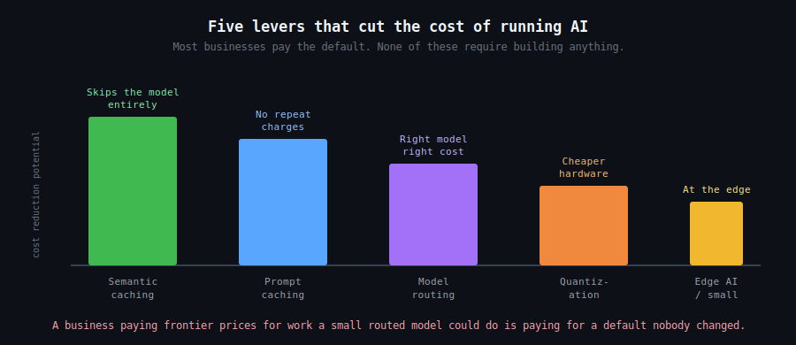

`2026 June 3`

There is a persistent belief that AI is expensive to run at scale. It was, briefly. The cost of a given task has been dropping fast, and the drop is driven by techniques most businesses never hear about because they sit below the surface of the tools they use.

[Semantic caching](disclaimer.md) skips the model entirely when a question close enough to a previous one has already been answered. [Prompt caching](disclaimer.md) stops you paying twice to process the same unchanging instructions. [Quantization](disclaimer.md) shrinks a model so it runs on cheaper hardware. [Model routing](disclaimer.md) sends each request to the cheapest model that can handle it rather than the most powerful one by default. And [small models running at the edge](disclaimer.md) handle a large share of everyday work for nearly nothing.

None of this requires building anything. It requires knowing the levers exist. A business paying frontier prices for work a routed small model could do is not the victim of expensive AI. It is paying for a default nobody changed.
