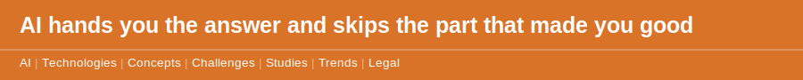

`2026 June 3`

Information has become free and instant. Formation has not, and the difference is where the real disruption sits.

A skilled tradesperson can look at a job and price it in seconds because they have priced a thousand jobs and been wrong on enough of them to learn. The [quote nobody wrote](disclaimer.md) concept points out that an AI can now produce that estimate instantly, which is useful, and also quietly removes the years of being wrong that trained the eye in the first place. The same pattern runs through reading, where the [unread book](disclaimer.md) concept observes that a summary keeps the argument and deletes the slow internal change that reading the whole thing produced. It runs through medicine, where the [self-diagnosing patient](disclaimer.md) concept describes someone who arrives already certain, turning the expert into a validator. And the [practice problem](disclaimer.md) concept names the cost directly: mastery needs the repetitions that AI now makes optional.

This is the deeper layer beneath the worry about [where the next generation of experts comes from](2026-05-31-apprentice-problem.md). It is not only that AI takes the junior's training tasks. It is that for everyone, at every level, the tool offers to skip the formative struggle and deliver the finished output. The struggle was never the inefficiency. It was the thing that turned information into judgement.

The decision, for a person or a business, is which struggles are worth keeping. Some friction is waste. Some friction is the only thing that makes you good. Telling them apart is now a survival skill, and almost no one is treating it as one.
