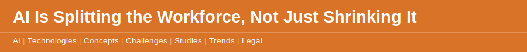
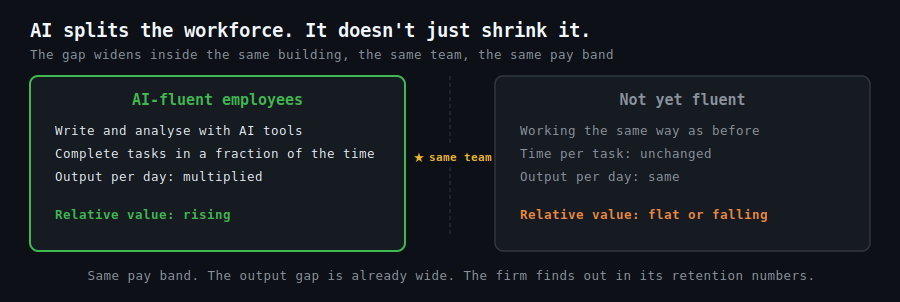

`2026 June 6`

The headline story about AI and jobs is subtraction — roles cut, headcount down. The more durable story is division. [Gartner's read on the Australian workforce](disclaimer.md) is that AI is splitting it, not uniformly lifting it: the people who have learned to work with the tools pull ahead, and the gap between them and everyone else widens inside the same building, the same team, the same pay band.

This sits underneath the much-quoted finding that [only a small fraction of organisations have actually scaled AI](disclaimer.md) while the rest run pilots. The divide is not only between firms; it is between people. [Entry-level roles are being hit first](disclaimer.md), which removes the rung on which the next generation used to learn — and the people already over that rung, fluent in the tools, become disproportionately valuable.

The lever most businesses underuse is the cheapest one. The [study of AI literacy and workforce upskilling](disclaimer.md) makes the case that the binding constraint is rarely the technology — it is the distance between what AI can do and what most staff believe it can do. The most exposed information work is the desk job, as the [information work exposure](2026-06-02-information-work-exposure.md) insight set out. The decision a firm actually faces is whether the split inside its own workforce is something it manages deliberately, or something it discovers in its retention numbers a year too late.
