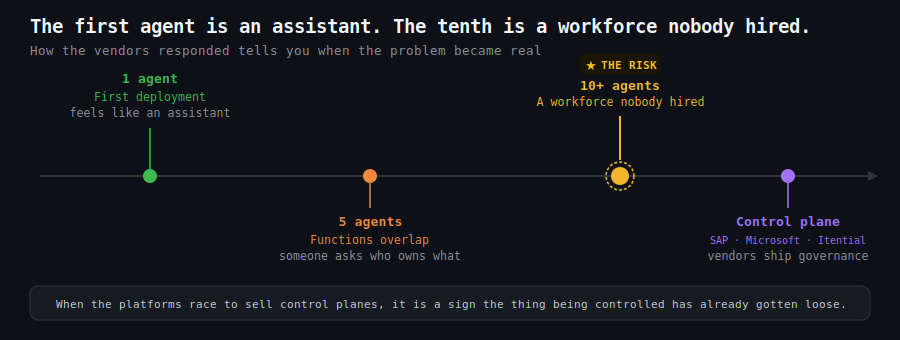

# The Agent Sprawl That Needs a Control Plane

`2026 June 6`

The first agent a business deploys feels like a clever assistant. The tenth feels like an unmanaged workforce nobody hired. The vendors have noticed the problem they helped create: [SAP shipped a command centre for agent sprawl](disclaimer.md), [Itential built governance into infrastructure agents at the point they are created](disclaimer.md), and [Microsoft packaged a management layer for agents across an organisation](disclaimer.md). When the big platforms race to sell control planes, it is a sign the thing being controlled has already gotten loose.

The risk is not hypothetical. The [Five Eyes alliance issued joint security guidance on agentic AI](disclaimer.md) — agents that can act, not just answer, are a genuine attack surface. The [study of zero-trust AI agents](disclaimer.md) sets the principle: never trust an agent's claimed identity, always verify before granting access. And the [study of agent evaluation](disclaimer.md) names the quieter problem — most businesses cannot actually test whether an agent does what it claims, which means they cannot tell a working one from a broken one until something goes wrong.

The [managing a workforce of agents](2026-06-03-managing-a-workforce-of-agents.md) insight made the point that someone still has to manage the agent you deploy. The control-plane wave is the institutional version of that truth. For a small firm the lesson is to resist accumulating agents the way an earlier era accumulated spreadsheets — each one useful, none of them governed, until the collection itself becomes the risk.
