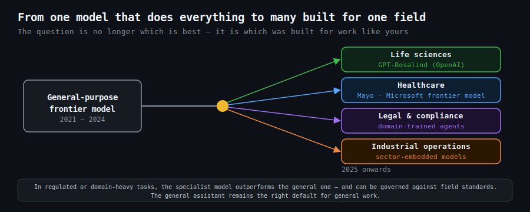

# The Frontier Model Starts to Specialise

`2026 June 6`

For three years the story was one of general-purpose models getting bigger and better at everything. A different chapter is opening: the frontier is beginning to split into specialists. [OpenAI sharpened a dedicated life-sciences model](disclaimer.md), and a [healthcare-specific frontier model emerged from a partnership where the clinical institution keeps the model and the platform company keeps the distribution](disclaimer.md). The general model is no longer the only product on the shelf.

This is the same movement the [study of vertical AI agents](disclaimer.md) anticipated: software built around one industry's workflows, vocabulary, and failure modes rather than adapted from a general assistant. A model that knows the shape of a clinical note, a customs declaration, or a legal precedent outperforms a general model on that narrow ground — and, just as important, it can be governed and evaluated against the standards of that field.

For a small business the practical takeaway is one of selection. The question is shifting from "which is the best model" to "which model was built for work like mine." The general assistant remains the right default for general work. But in regulated or domain-heavy tasks, the specialist is starting to win — and the firms that notice the split early will be choosing tools their competitors do not yet know exist.
