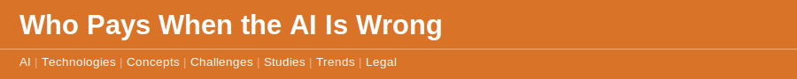

`2026 June 6`

Every business deploying AI is quietly taking on a liability question it has not answered. The [study of AI liability and professional indemnity](disclaimer.md) makes the gap explicit: when an AI system produces a wrong answer that causes loss — a misfiled return, a bad clause, a missed flag — most existing insurance policies are silent on whether they cover it. The tool was confident. The output looked right. The liability did not disappear; it just has no clear owner.

The market has noticed. A [reinsurer has launched cover specifically for AI hallucination](disclaimer.md) — a signal that the risk is real enough to price. It exists because language models, as the [study of hallucination](disclaimer.md) explains, state falsehoods with the same fluency they state facts, and there is no reliable internal signal separating the two. Fluency is not accuracy, and the gap is where the loss lives.

The [moral crumple zone](disclaimer.md) concept names the human cost of leaving this unresolved: when an automated system fails, blame tends to land on whichever person was nearest the controls, even when they had little real control. The [liability of knowing](disclaimer.md) concept points the other way — once a tool makes something knowable, failing to check it stops being an excuse. For a practitioner the implication is not to avoid AI but to be precise about it: name which outputs a human signs off, write that review into the process, and check what the indemnity policy actually says before the wrong answer arrives, not after.
