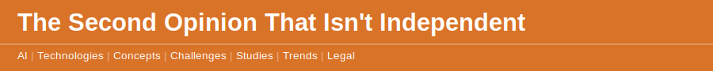

`2026 June 9`

When you ask a second person to check the first person's work, the value comes from independence — two minds that fail in different ways, so the error one misses the other catches. A great deal of AI deployment quietly throws that away. The market is [concentrating around a small number of foundation models](disclaimer.md), and when even a company as large as Apple chooses to [rent another firm's model to power its assistant](disclaimer.md), the direction is unmistakable. More and more of the world's answers are coming from fewer and fewer brains.

The trap is subtle. If one model drafts the work and the same model checks it, the agreement is built in. The [Second Opinion That Agrees](disclaimer.md) concept names it exactly: the blind spots are identical, so every error is correlated rather than caught. The reviewer cannot see what the author could not see, because they are the same system. The check feels like assurance and provides none. And the underlying flaw it is meant to catch — [a model stating something false with complete confidence](disclaimer.md) — is exactly the kind of error a mirror cannot find.

There is a practical hedge. [Routing different steps to different models](disclaimer.md) restores some of the independence that monoculture removes, and keeping a human in the loop for the judgement that matters restores the rest. A second opinion is only worth having if it can disagree. Make sure yours still can.
